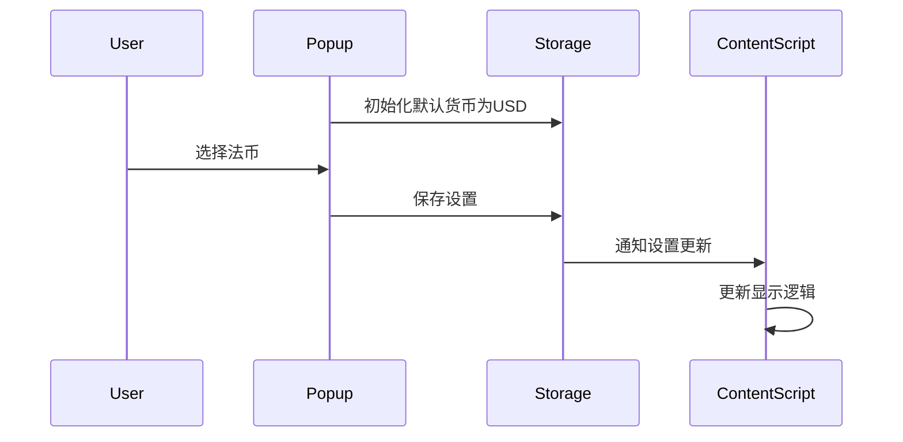

# 加密货币扩展改造方案

## 受影响文件列表
1. popup/popup.html
2. popup/popup.js
3. content_scripts/content.js

## 主要修改内容

### popup/popup.html
1. 重命名defaultCurrency为selectedCrypto
2. 添加法币选择器，默认选择美元
```html
<div class="setting">
  <label for="currency">Display Currency:</label>
  <select id="currency">
    <option value="USD" selected>US Dollar (USD)</option>
    <option value="CNY">Chinese Yuan (CNY)</option>
    <option value="EUR">Euro (EUR)</option>
  </select>
</div>
```

### popup/popup.js
1. 更新变量名和存储逻辑
2. 设置默认货币为美元
```javascript
const currency = document.getElementById('currency');

chrome.storage.sync.get(['selectedCrypto', 'currency', 'refreshInterval', 'lastUpdated'], (result) => {
  if (result.currency) {
    currency.value = result.currency;
  } else {
    currency.value = 'USD'; // 默认值
  }
  // 其他逻辑保持不变
});

const settings = {
  selectedCrypto: selectedCrypto.value,
  currency: currency.value,
  refreshInterval: interval,
  lastUpdated: Date.now()
};
```

### content_scripts/content.js
1. 修改showTip函数支持多种货币显示
```javascript
function showTip(text, usdValue, currency) {
  const currencySymbols = {
    USD: '$',
    CNY: '¥',
    EUR: '€'
  };
  const symbol = currencySymbols[currency] || '$';
  tip.textContent = `${text} ≈ ${symbol}${usdValue.toFixed(2)}`;
}
```

## 数据流规划


## 推荐的变量命名方案
1. selectedCrypto - 当前选择的加密货币
2. currency - 当前选择的法币
3. currencySymbols - 法币符号映射表